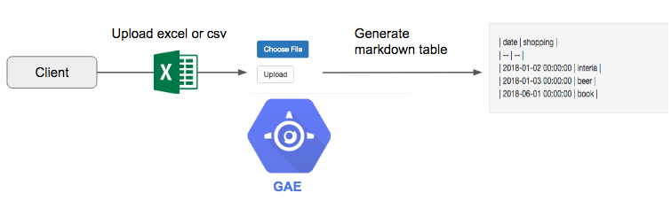

# Introduction

This is unofficial tutorial about Google App Engine.

This demo will take you through the steps to deploy python 3.7 application to Google App Engine.

### Feature about second generation runtime

From second generation runtime, it is introduced gVisor-based container sandbox, which is strong isoration mechanism.

Restrictions is fewer than first generation runtime, for examle, the following features are available.

* Install arbitrary third party dependencies
* Files can be temporarily written to /tmp

For more detail about secont generation runtime, please see the following documentation.

* [App Engine standard environment runtimes](https://cloud.google.com/appengine/docs/standard/appengine-generation)

* [Understanding differences between Python 2 and Python 3 on the App Engine standard environment](https://cloud.google.com/appengine/docs/standard/python3/python-differences)

### Overview about this demo

In this demo, deploy web application which convert excel or csv file to markdown table.



Web application framework is Flask. This application composed by the following packages, thease packages are specified in ```requirements.txt``` file.

* flask
* flask-bootstrap
* pandas
* xlrd

This application use ```/tmp``` directory, where temporary file location about uploaded file.

# Let's deploy app to the GAE.

### cloning sources

```
$ git clone https://github.com/ao-log/gae-2nd-generation-python-demo
$ cd gae-2nd-generation-python-demo
```

### deploy app

```
$ gcloud app deploy .
```
